<div class="MCWHeader1">
Microservices architecture - Developer edition
</div>

<div class="MCWHeader2">
Hands-on lab step-by-step
</div>

<div class="MCWHeader3">
June 2018
</div>

Information in this document, including URL and other Internet Web site references, is subject to change without notice. Unless otherwise noted, the example companies, organizations, products, domain names, e-mail addresses, logos, people, places, and events depicted herein are fictitious, and no association with any real company, organization, product, domain name, e-mail address, logo, person, place or event is intended or should be inferred. Complying with all applicable copyright laws is the responsibility of the user. Without limiting the rights under copyright, no part of this document may be reproduced, stored in or introduced into a retrieval system, or transmitted in any form or by any means (electronic, mechanical, photocopying, recording, or otherwise), or for any purpose, without the express written permission of Microsoft Corporation.

Microsoft may have patents, patent applications, trademarks, copyrights, or other intellectual property rights covering subject matter in this document. Except as expressly provided in any written license agreement from Microsoft, the furnishing of this document does not give you any license to these patents, trademarks, copyrights, or other intellectual property.

The names of manufacturers, products, or URLs are provided for informational purposes only and Microsoft makes no representations and warranties, either expressed, implied, or statutory, regarding these manufacturers or the use of the products with any Microsoft technologies. The inclusion of a manufacturer or product does not imply endorsement of Microsoft of the manufacturer or product. Links may be provided to third party sites. Such sites are not under the control of Microsoft and Microsoft is not responsible for the contents of any linked site or any link contained in a linked site, or any changes or updates to such sites. Microsoft is not responsible for webcasting or any other form of transmission received from any linked site. Microsoft is providing these links to you only as a convenience, and the inclusion of any link does not imply endorsement of Microsoft of the site or the products contained therein.

© 2018 Microsoft Corporation. All rights reserved.

Microsoft and the trademarks listed at <https://www.microsoft.com/en-us/legal/intellectualproperty/Trademarks/Usage/General.aspx> are trademarks of the Microsoft group of companies. All other trademarks are property of their respective owners.

**Contents**

<!-- TOC -->

- [Microservices architecture -- developer edition hands-on lab step-by-step](#microservices-architecture----developer-edition-hands-on-lab-step-by-step)
    - [Abstract and learning objectives](#abstract-and-learning-objectives)
    - [Overview](#overview)
    - [Solution architecture](#solution-architecture)
    - [Requirements](#requirements)
    - [Exercise 1: Environment setup](#exercise-1-environment-setup)
        - [Task 1: Download and open the ContosoEventsPoC starter solution](#task-1-download-and-open-the-contosoeventspoc-starter-solution)
        - [Task 2: API Management](#task-2-api-management)
        - [Task 3: Web App](#task-3-web-app)
        - [Task 4: Function App](#task-4-function-app)
        - [Task 5: Storage account](#task-5-storage-account)
        - [Task 6: Cosmos DB](#task-6-cosmos-db)
    - [Exercise 2: Implementing the Service Fabric solution](#exercise-2-implementing-the-service-fabric-solution)
        - [Task 1: Interacting with an Actor's State](#task-1-interacting-with-an-actors-state)
        - [Task 2: Interacting with a Stateful Service](#task-2-interacting-with-a-stateful-service)
        - [Task 3: Interacting with an Actor from a Web API Controller](#task-3-interacting-with-an-actor-from-a-web-api-controller)
        - [Task 4: Inspecting Service Partitions](#task-4-inspecting-service-partitions)
    - [Exercise 3: Placing ticket orders](#exercise-3-placing-ticket-orders)
        - [Task 1: Run the solution](#task-1-run-the-solution)
        - [Task 2: Test the application](#task-2-test-the-application)
        - [Task 3: Service Fabric Explorer](#task-3-service-fabric-explorer)
        - [Task 4: Set up the Ticket Order Sync queue](#task-4-set-up-the-ticket-order-sync-queue)
        - [Task 5: Set up the functions](#task-5-set-up-the-functions)
        - [Task 6: Test order data sync](#task-6-test-order-data-sync)
    - [Exercise 4: Publish the Service Fabric Application](#exercise-4-publish-the-service-fabric-application)
        - [Task 1: Publish the application](#task-1-publish-the-application)
        - [Task 2: Test an order from the cluster](#task-2-test-an-order-from-the-cluster)
    - [Exercise 5: API Management](#exercise-5-api-management)
        - [Task 1: Import API](#task-1-import-api)
        - [Task 2: Retrieve the user subscription key](#task-2-retrieve-the-user-subscription-key)
        - [Task 3: Configure the Function App with the API Management key](#task-3-configure-the-function-app-with-the-api-management-key)
    - [Exercise 6: Configure and publish the web application](#exercise-6-configure-and-publish-the-web-application)
        - [Task 1: Configure the web app settings](#task-1-configure-the-web-app-settings)
        - [Task 2: Running the web app and creating an order](#task-2-running-the-web-app-and-creating-an-order)
        - [Task 3: Publish the web app](#task-3-publish-the-web-app)
    - [Exercise 7: Upgrading](#exercise-7-upgrading)
        - [Task 1: How upgrade works](#task-1-how-upgrade-works)
        - [Task 2: Update an actor state](#task-2-update-an-actor-state)
        - [Task 3: Perform a smooth upgrade](#task-3-perform-a-smooth-upgrade)
        - [Task 4: Submit a new order](#task-4-submit-a-new-order)
    - [After the hands-on lab](#after-the-hands-on-lab)
        - [Task 1: Delete the resource group](#task-1-delete-the-resource-group)

<!-- /TOC -->

# Microservices architecture -- developer edition hands-on lab step-by-step

## Abstract and learning objectives

This whiteboard design session is designed to help attendees gain a better understanding of implementing architectures leveraging aspects from microservices and serverless architectures, by helping an online concert ticket vendor survive the first 5 minutes of crushing load. They will handle the client\'s scaling needs through microservices built on top of Service Fabric, and apply smooth updates or roll back failing updates. Finally, students will design an implementation of load testing to optimize the architecture for handling spikes in traffic.

Attendees will learn how to:

-   Implement scale and resiliency with Service Fabric

-   Enable serverless solutions with Azure Functions

-   Control API access with API Management

-   Provide query flexibility with Cosmos DB

## Overview

Contoso Events is an online service for concerts, sporting and other event ticket sales. They are redesigning their solution for scale with a microservices strategy and want to implement a POC for the path that receives the most traffic: ticket ordering.

In this hands-on lab, you will construct an end-to-end POC for ticket ordering. You will leverage Service Fabric, API Management, Function Apps, Web Apps, and Cosmos DB.

![The Event Ticket sales flowchart begins with Azure AD B2C, which points to Contoso Events Site Web App. A bi-directional arrow points between the Web App and API Manager, which in turn has a bi-direction arrow pointing between it and Web API (Stateless Service). An arrow points from there to Ticket Order Service (Stateful Service), which points to Ticket Order Actor (Processor). The Web API, Ticket Order Service, and Ticket Order Actor are all part of the Contoso Events Service Fabric App. from Ticket Order Actor, an arrow points to Order Externalization (Queue), then on to Process Order Externalization (Azure Function), and ends at Cosmos DB (Orders Collection). ](images/Labs/image2.png "Event Ticket sales flowchart")

## Solution architecture

The following figures are intended to help you keep track of all the technologies and endpoints you are working with in this hands-on lab. The first figure is the overall architecture, indicating the Azure resources to be employed. The second figure is a more detailed picture of the key items you will want to remember about those resources as you move through the exercises.


## Requirements

1.  Microsoft Azure subscription must be pay-as-you-go or MSDN.

    a.  Trial subscriptions will not work.

2.  A virtual machine configured with (see Before the hands-on lab):

    b.  Visual Studio 2017 Community edition, or later

    c.  Azure Development workload enabled in Visual Studio 2017 (enabled by default on the VM)

    d.  Service Fabric SDK 3.1 or later for Visual Studio 2017

    e.  Google Chrome browser (Swagger commands do not work in IE)

    f.  PowerShell 3.0 or higher (v5.1 already installed on VM)

## Exercise 1: Environment setup

Duration: 30 minutes

Contoso Events has provided a starter solution for you. They have asked you to use this as the starting point for creating the Ticket Order POC solution with Service Fabric.

Because this is a "born in Azure" solution, it depends on many Azure resources. You will be guided through creating those resources before you work with the solution in earnest. The following figure illustrates the resource groups and resources you will create in this exercise.


### Task 1: Download and open the ContosoEventsPoC starter solution

1.  On your Lab VM, download the starter project from <http://bit.ly/2t1HhbS>. (Note: the URL is case sensitive, so you may need to copy and paste it into your browser's address bar.)

2.  Unzip the contents to the folder C:\\handsonlab.

3.  Locate the solution file (C:\\handsonlab\\ContosoEventsPoC\\Src\\ContosoEventsPOC.sln), and double-click it to open it with Visual Studio 2017.

4.  If prompted about how you want to open the file, select Visual Studio 2017, and select OK.

    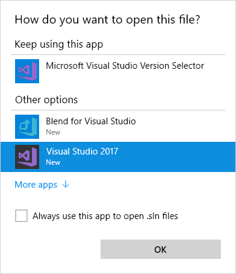

5.  Log into Visual Studio or set up an account, when prompted.

    

6.  If presented with a security warning, uncheck Ask me for every project in this solution, and select OK.

    

7.  If you are missing any prerequisites (listed under Requirements above), you may be prompted to install these at this point.

8.  Before you attempt to compile the solution, set the configuration to x64 by selecting it from the Solution Platforms drop down in the Visual Studio toolbar.

    

9.  Build the solution, by selecting Build from the Visual Studio menu, then selecting Build Solution.

    

10. You will have some compile-time errors at this point. These are expected, and will be fixed as you proceed with the hands-on lab.

### Task 2: API Management

In this task, you will provision an API Management Service in the Azure portal.

1.  In the Azure portal, select +New, enter "API Management" into the Search the Marketplace box, then select API management from the results.

    

2.  In the API Management blade, select Create.

3.  In the API Management service blade, enter the following:

    a.  Name: Enter a unique name, such as contosoevents-SUFFIX

    b.  Subscription: Choose your subscription

    c.  Resource group: Select Use existing, and select the hands-on-labs resource group you created previously.

    d.  Location: Select the same region used for the hands-on-labs resource group

    e.  Organization name: Enter Contoso Events

    f.  Administrator email: Enter your email address

    g.  Pricing tier: Select Developer (No SLA)

    h.  Select Create

    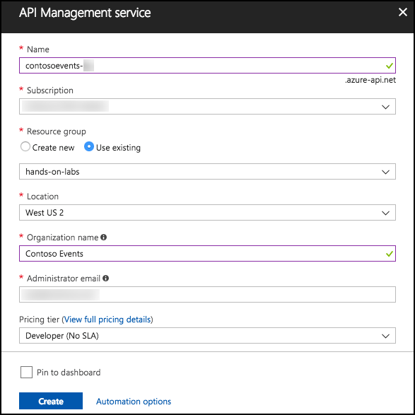

4.  After the API Management service is provisioned, the service will be listed in the Resource Group. This may take up to 10-15 minutes, so move to Task 3 and return later to verify.

### Task 3: Web App

In these steps, you will provision a Web App in a new App Service Plan.

1.  Select +New in the Azure Portal, select Web, then select Web App.

    

2.  On the Create Web App blade, enter the following:

    a.  App name: Enter a unique name, such as contosoeventsweb-SUFFIX

    b.  Subscription: Select your subscription

    c.  Resource group: Select Use existing, and select the hands-on-labs resource group created previously.

    d.  OS: Select Windows

    e.  App Service plan/location: Select this, select Create new

        i.  App service plan: Enter contosoeventsplan-SUFFIX

        ii. Location: Select the same location you have been using for other resources in this lab

        iii. Pricing tier: Select S1 Standard

        iv. Select OK

    f.  Select Create to provision the Web App.

    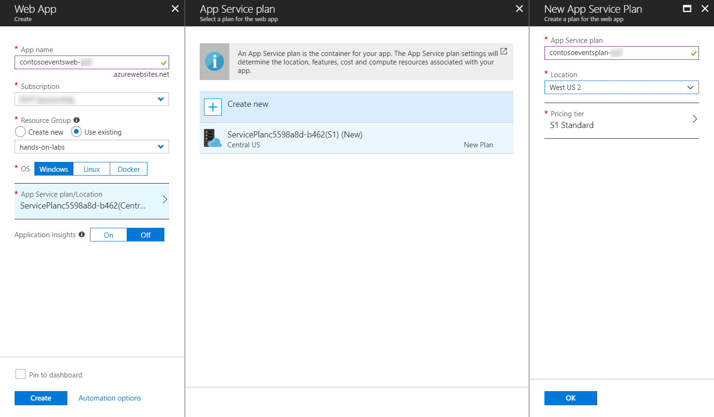

3.  You will receive a notification in the Azure portal when the Web App deployment completes. From this, select Go to resource.

    

4.  On the Web Apps Overview blade, you can see the URL used to access your Web App. If you select this, it will open an empty site, indicating your App Services app is up and running.

    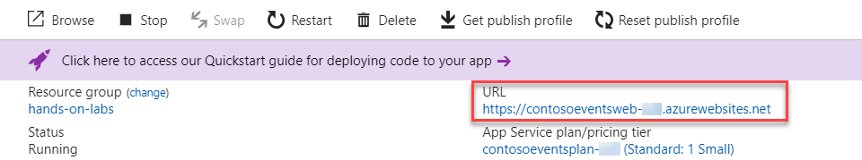

### Task 4: Function App

In this task, you will provision a Function App using a Consumption Plan. By using a Consumption Plan, you enable dynamic scaling of your Functions.

1.  Select +New in the Azure Portal, and enter "Function App" in the Search the Marketplace box, then select Function App from the results.

    

2.  Select Create on the Function App blade.

3.  On the Create Function App blade, enter the following:

    a.  App name: Enter a unique name, such as contosoeventsfn-SUFFIX

    b.  Subscription: Select your subscription

    c.  Resource group: Select Use existing, and select the hands-on-labs resource group created previously

    d.  OS: Select Windows

    e.  Hosting Plan: Select Consumption Plan

    f.  Location: Select the same location as the hands-on-labs resource group

    g.  Storage: Leave Create new selected, and accept the default name

    h.  Application Insights: Select Off

    i.  Select Create to provision the new Function App

    

### Task 5: Storage account

In this section, you will create a Storage account for the application to create and use queues required by the solution.

1.  In the Azure portal, select +New, Storage, then select Storage account -- blob, file, table, queue under Featured.

    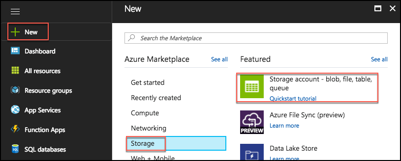

2.  In the Create Storage account blade, enter the following:

    a.  Name: Enter a unique name, such as contosoeventsSUFFIX

    b.  Deployment model: Select Resource manager

    c.  Account kind: Select Storage (general purpose v1)

    d.  Location: Select the same location as the hands-on-labs resource group

    e.  Replication: Select Locally-redundant storage (LRS)

    f.  Performance: Select Standard

    g.  Secure transfer required: Leave Disabled

    h.  Subscription: Select your subscription

    i.  Resource group: Select Use existing, and select the hands-on-labs resource group created previously

    j.  Virtual networks: Leave Disabled

    k.  Select Create

    

### Task 6: Cosmos DB

In this section, you will provision a Cosmos DB account, a Cosmos DB Database and a Cosmos DB collection that will be used to collect ticket orders.

1.  In the Azure portal, select +New, Databases, then select Azure Cosmos DB.

    

2.  On the Azure Cosmos DB blade, enter the following:

    a.  ID: Enter a unique value, such as contosoeventsdb-SUFFIX

    b.  API: Select SQL

    c.  Subscription: Select your subscription

    d.  Resource group: Select Use existing, and select the hands-on-labs resource group previously created

    e.  Location: Select the location used for the hands-on-lab resource group. If this location is not available, select one close to that location that is available.

    f.  Enable geo-redundancy: Leave checked

    g.  Select Create to provision the Cosmos DB

    

3.  When the Cosmos DB account is ready, navigate to the hands-on-labs Resource Group, and select your Cosmos DB account from the list.

    

4.  On the Cosmos DB account blade, under Collections in the left-hand menu, select Browse.

    

5.  On the Browse blade, select +Add Collection.

    

6.  On the Add Collection dialog, enter the following:

    a.  Database id: Select Create new and enter TicketManager

    b.  Provision database throughput: Leave unchecked

    c.  Collection id: Enter Orders

    d.  Storage capacity: Select Fixed (10 GB)

    e.  Throughput: Enter 2500

    f.  Select OK to create the new collection

    

7.  Select New collection from the screen that appears.

    

8.  In the Add Collection dialog, enter the following:

    a.  Database id: Select Use existing and then select TicketManager

    b.  Collection id: Enter Events

    c.  Storage capacity: Select Fixed (10 GB)

    d.  Throughput: Enter 2500

    e.  Select OK to create the new collection

    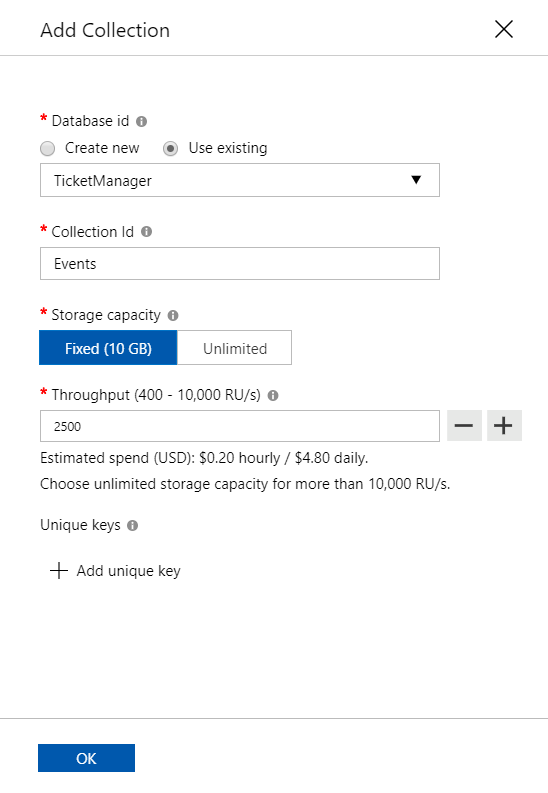

9.  You will be able to see that the two collections exist in the new database.

    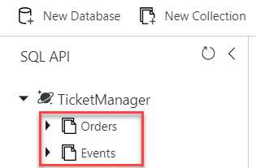

## Exercise 2: Implementing the Service Fabric solution

Duration: 60 minutes

The agreed upon design with Contoso Events involves queuing ticket orders, and executing them asynchronously. A stateless Web API service receives the request, and queues it to a stateful service. An actor processes the request, and persists the order in its state.

The design also calls for saving the state of the ticket order to a Cosmos DB collection for ad hoc queries. This exercise will guide you through adding configurations that will light up the actor code that externalizes its state to a storage queue. In addition, you will set up the Function App to read from the queue, and persist the order to the Orders collection of the Cosmos DB instance you created.

> Note: The code to write to the storage queue is already in place within the actor, so setting up configuration keys is the only requirement to lighting up that feature.


### Task 1: Interacting with an Actor's State

In this task, you will write code to process the cancellation of an order by interacting with the Ticket Order Actor. To cancel an order, a Ticket Order Actor instance must be retrieved, and the CancelTicket operation it provides is invoked that changes the actor's state to reflect a "canceled" status.

1.  On your Lab VM, with the ContosoEventsPoC solution open in Visual Studio, use the Solution Explorer to open the TicketOrderActor.cs file, in the Service Fabric folder, under the ContosoEvents.TicketOrderActor project.

    

2.  Locate the CancelOrder method (line 239).

3.  Locate the following TODO, and complete the commented line by replacing it with the following:

```
    //TODO: Task 1.1 - Acquire an instance of the Actor
    IEventActor eventActor = this.ActorLocationService.Create<IEventActor>(new ActorId(state.EventId), Constants.ContosoEventsApplicationName);
```

4.  Locate the following TODO and complete the commented line by replacing it with the following:

```
    //TODO: Task 1.2 - Invoke the Cancel Ticket Operation with the supplied state
    await eventActor.CancelTickets(state);
```

5.  Locate the following TODO and complete the commented lines by replacing them with the following:

```
    //TODO: Task 1.3 - Update the state object to reflect that the order is cancelled
    state.CancellationDate = DateTime.Now;
    state.IsFulfilled = false;
    state.IsCancelled = true;
```

6.  Locate the following TODO and complete the commented line by replacing it with the following:

```
    //TODO: Task 1.4 - Save the updated state
    await SetEntityStateAsync(state);
```

7.  Navigate to the SetEntityStateAsync method implementation, locate the following TODO, and complete the commented line by replacing it with the following:

```
    //TODO: Task 1.5 - update the actor state with the new state
    await this.StateManager.SetStateAsync<TicketOrder>(ActorStatePropertyName, state);
```

8.  Save the file. At this point you have completed the code to cancel an order using the Ticket Order Actor. However, the solution is still incomplete (and will not compile if you try to). Continue to the next task.

### Task 2: Interacting with a Stateful Service

In this task, you will write code to enqueue an order to the Ticket Order Stateful Service whenever and order is being processed. This Order is enqueued by the Web API and then dequeued by the Ticket Order Stateful Service for processing by the Ticket Order Actor. To accomplish this, the order will be enqueued into a reliable queue.

1.  Using Solution Explorer open TicketOrderService.cs under the ContosoEvents.TicketOrderService project.

    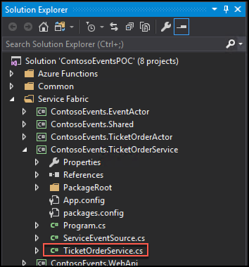

2.  Locate the EnqueueOrder method. (line 67)

3.  Locate the following TODO and complete the commented line by replacing it with the following:

```
    //TODO: Task 2.1 - Get (or create) a reliable queue called ???OrderQueue??? in this partition.
    var requests = await this.StateManager.GetOrAddAsync<IReliableQueue<TicketOrder>>(OrderQueueName);
```

4.  Locate the following TODO and complete the commented line by replacing it with the following:

```
    //TODO: Task 2.2 - Create a new transaction scope
    using (var tx = this.StateManager.CreateTransaction())
    {
```

5.  Locate the following TODO and complete the commented line by replacing it with the following:

```
    //TODO: Task 2.3 - Enqueue the order to the reliable queue within the transaction
    await requests.EnqueueAsync(tx, order);
```

6.  Locate the following TODO and complete the commented line by replacing it with the following:

```
    //TODO: Task 2.4 - Commit the transaction if enqueue was successful
    await tx.CommitAsync();
    }
```

7.  Save the file. At this point you have completed the code to enqueue a message to the reliable queue. However, the solution is still incomplete (and will not compile if you try to). Continue to the next task.

### Task 3: Interacting with an Actor from a Web API Controller

In this task, you will write code that runs within the Orders Web API controller that delegates the cancellation request to the actor.

1.  Using Solution Explorer, open the OrdersController.cs file, in the Controllers folder of the ContosoEvents.WebApi project.

    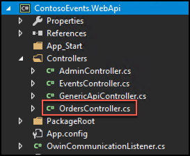

2.  Locate the CancelOrder method. (line 179)

3.  Locate the following TODO and complete the commented line by replacing it with the following:

```
    //TODO: Task 3.1 - Get the actor location service
    IActorLocationService locator = ServiceFactory.GetInstance().GetActorLocationService();
```

4.  Locate the following TODO and complete the commented line by replacing it with the following:

```
    //TODO: Task 3.2 - Acquire the Order Actor instance
    ITicketOrderActor orderActor = locator.Create<ITicketOrderActor>(new ActorId(id), Constants.ContosoEventsApplicationName);
```

5.  Locate the following TODO and complete the commented line by replacing it with the following:

```
    //TODO: Task 3.3 - Cancel the order
    await orderActor.CancelOrder();
```

6.  Save the file. At this point you have completed the code to cancel the order in response to a request against the OrdersController CancelOrder operation. However, the solution is still incomplete (and will not compile if you try to). Continue to the next task.

### Task 4: Inspecting Service Partitions

In this task, you will write code that runs within the Admin Web API controller that uses the Fabric Client to get information about all the Ticket Order Service partitions.

1.  Using Solution Explorer, open AdminControllers.cs in the Controllers folder in the ContosoEvents.WebApi project.

    

2.  Locate the GetTicketOrderPartitions method. (line 37)

3.  Locate the following TODO and complete the commented line by replacing it with the following:

```
    //TODO: Task 4.1 - Use the FabricClient to get the list of partitions for the Ticket Order Service  
    ServicePartitionList partitions = await _fabricClient.QueryManager.GetPartitionListAsync(builder.ToUri());
```

4.  Locate the following TODO and complete the commented line by replacing it with the following:

```
    //TODO: Task 4.2 - Collect the partition info
    infos.Add(new TicketOrderServiceInfo()
    {
    PartitionId = p.PartitionInformation.Id.ToString(),
    PartitionKind = p.PartitionInformation.Kind.ToString(),
    PartitionStatus = p.PartitionStatus.ToString(),
    NodeName = await dispenderService.GetNodeName(),
    HealthState = p.HealthState.ToString(),
    ServiceKind = p.ServiceKind.ToString(),
    ItemsInQueue = await dispenderService.GetOrdersCounter(CancellationToken.None)
    });
```

5.  Save the file. At this point you have completed the code to inspect the partition information. Continue to the next exercise to run the solution and verify functionality.

## Exercise 3: Placing ticket orders

Duration: 30 minutes

In this exercise, you will test that your completed solution works by running locally on your Lab VM.

### Task 1: Run the solution

The purpose of this task is to make sure that the source code compiles, and that you can publish to a local cluster. To make sure that the app is running flawlessly, you will run some API tests and access the Service Fabric explorer.

Note: Not all features are in place, but you will be able to see that the application can run.

1.  On the Lab VM, make sure the local Service Fabric environment is running by selecting the arrow in the system tray, and checking for the appearance of the Service Fabric icon. Note: You may need to restart your VM if you've recently installed the Service Fabric Local Cluster Manager, for the icon to appear.

    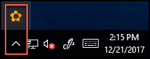

2.  If it is not there, you will need to start the local Service Fabric cluster. To do this, select the Start menu, scroll down to the apps listed under "S," and select Service Fabric Local Cluster Manager. The icon (Step 1) should now appear.

    

3.  Right-click the system tray icon, and select Setup Local Cluster, 1 Node.

    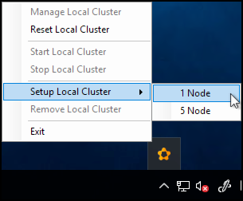

4.  You should see a message that the local cluster is setting up.

    

5.  Note: Sometimes you will see an error message appear indicating the cluster setup is retrying.

6.  Open the ContosoEventsPoc solution in Visual Studio, if it is not still open from the previous exercise.

7.  Rebuild the solution to resolve all NuGet packages, and to make sure there are no compilation errors, by selecting Build from the menu, then selecting Rebuild Solution.

    

8.  After the rebuild, you should see a Rebuild All succeeded message in the bottom left corner of Visual Studio, and that there are 0 Errors. Note: You may see some warnings, but these can be safely ignored.

    

9.  Now, you will Publish the Service Fabric app to the local cluster.

10. In Solution Explorer, right-click the Service Fabric Application, ContosoEventsApp, and select Publish.

    

11. In the Publish Service Fabric Application dialog, select PublishProfiles\\Local.1Node.xml for the Target profile, ensure the correct account is selected, and select Publish.

    

    > **Note**: If you have an error such as: "The project does not have a package action set." you can restart Visual Studio, re-open the solution, and this will resolve the problem.

12. You can see the publish status in the Visual Studio output pane, at the bottom of the window. When the publish process is complete, you will see a success message in the output pane. The application is ready to be used.

    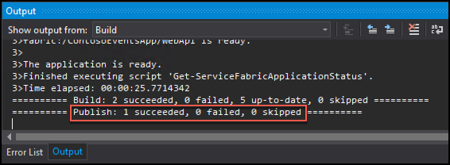

### Task 2: Test the application

The Service Fabric Application includes a front-end Web API as the public-facing window to internal stateful services. In this task, you will check that you can call the Web API now that you have the application published to the local cluster. Because the app is not yet fully configured, not all Web API methods will be fully functional.

1.  On the Lab VM, open a Chrome browser, navigate to the Swagger endpoint for the Web API at: <http://localhost:8082/swagger/ui/index>. Note the three API endpoints: Admin, Events, and Orders.

    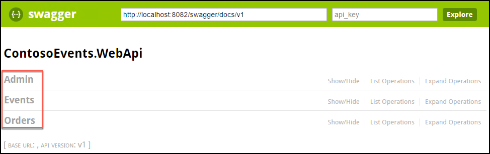

2.  Select the Admin API, and observe the list of methods available.

    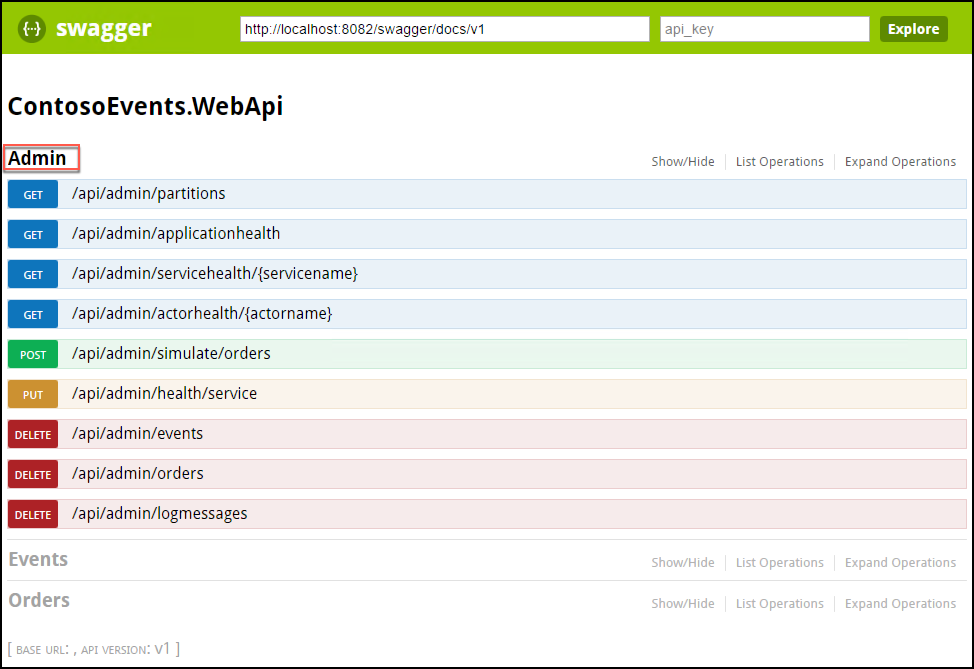

3.  Select /api/admin/partitions, then select Try it out.

    

4.  Make sure it returns a Response Code of 200, as shown in the following screen shot. This API endpoint returns the number of tickets queued across all partitions.

    

5.  After viewing the Swagger definition, and receiving a success response code from the partitions method, your environment is in a good state to continue.

### Task 3: Service Fabric Explorer

In this task, you will browse to the Service Fabric Explorer, and view the local cluster.

1.  On your Lab VM, open a new tab in your Chrome browser, and navigate to the Service Fabric Explorer for the local cluster at <http://localhost:19080/Explorer/index.html>.

    

2.  Observe that the ContosoEventsApp is deployed with the following services:

    a.  fabric:/ContosoEventsApp/EventActorService

    b.  fabric:/ContosoEventsApp/TicketOrderActorService

    c.  fabric:/ContosoEventsApp/TicketOrderService

    d.  fabric:/ContosoEventsApp/WebApi

    

### Task 4: Set up the Ticket Order Sync queue

In this task, you will complete features of the Contoso Events POC so that placing an order also syncs with the back-end data store. You will also update the configuration settings to reference the Azure resources you previously created correctly.

1.  Return to Visual Studio, and from Solution Explorer, open Local.1Node.xml, located in the ApplicationParameters folder under the ContosoEventsApp project in the Service Fabric folder.

    

2.  Locate the following Parameter block in the file. In the steps below, you will retrieve the values needed to update Local.1Node.xml with your own configuration parameters.

```
    <Parameter Name="DataStorageEndpointUri" Value="" />
    <Parameter Name="DataStoragePrimaryKey" Value="" />
    <Parameter Name="DataStorageDatabaseName" Value="TicketManager" />
    <Parameter Name="DataStorageEventsCollectionName" Value="Events" />
    <Parameter Name="DataStorageOrdersCollectionName" Value="Orders" />
    <Parameter Name="DataStorageLogMessagesCollectionName" Value="LogMessages" />
    <Parameter Name="StorageConnectionString" Value="" />
    <Parameter Name="LogsStorageTableName" Value="prodlogs" />
    <Parameter Name="ExternalizationQueueName" Value="contosoevents-externalization-requests"/>
    <Parameter Name="SimulationQueueName" Value="contosoevents-simulation-requests" />
```

Cosmos DB settings:

1.  In the Azure Portal, browse to the Azure Cosmos DB account you created in Exercise 1, Task 6, and select Keys, under Settings in the left-hand menu.

    

2.  Select the Copy button next to the URI value, return to the Local.1Node.xml file in Visual Studio, and paste the URI value into the value for the DataStorageEndpointUri parameter.

3.  Now, on your Cosmos DB keys blade, copy the Primary Key value, return to the Local.1Node.xml file in Visual Studio, and paste the Primary Key value into the value for the DataStoragePrimaryKey parameter.

4.  Back in the Azure portal, select Browse under Collections in the left-hand menu for your Cosmos DB. The database (TicketManager) and collection (Orders and Events) names are pre-set in the Local.1Node.xml file, so verify these match the collection and database names you see in the Azure portal.

    

5.  If you used a different database name, modify the value of the DataStorageDatabaseName parameter to reflect the Cosmos DB database name.

6.  If you used a different collection names for the Orders or Events collections, modify the values of the DataStorageEventsCollectionName and DataStorageOrdersCollectionName parameters to match your names.

7.  Save the Local.1Node.xml file. The Cosmos DB parameters should now resemble the following:

    

Storage settings:

1.  In the Azure Portal, browse to the Storage account you created in Exercise 1, Task 5, and select Access keys under Settings in the left-hand menu.

2.  Select the copy button to the right of key1 Connection String to copy the value.

    

3.  Return to the Local.1Node.xml file in Visual Studio, and paste the key 1 Connection String into the value for the StorageConnectionString parameter, and save Local.1Node.xml.

    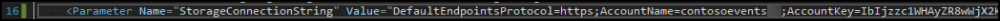

Test configurations:

1.  In Visual Studio, rebuild and publish the application to the local cluster using the steps you followed previously.

2.  After the application is fully published, use Chrome to browse to the Swagger endpoint at <http://localhost:8082/swagger/ui/index>.

3.  Select the Orders API methods, and select the POST operation for /api/orders.

    

4.  POST an order to the Contoso Events application. Copy the order request JSON below into the order value box, and select Try it out.

    ```
        {
        "UserName": "johnsmith",
        "Email": "john.smith@gmail.com",
        "EventId": "EVENT1-ID-00001",
        "PaymentProcessorTokenId": "YYYTT6565661652612516125",
        "Tickets": 3
        }
    ```

    

5.  This should return successfully, with an HTTP 200 response code. The Response Body contains a unique order id that clients could use to track the order.

    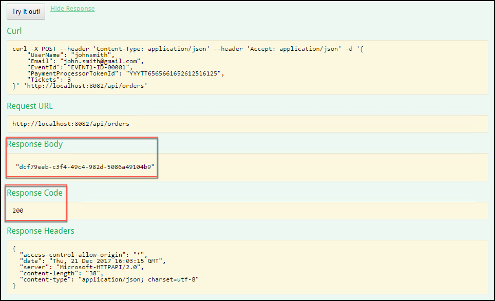

    > **Note**: This sends the order to the Web API, which in turn queues the order with the Ticket Order Processing queue. Ultimately, the Ticket Order Actor will pick up the message and process the order.

6.  Now, you should have an order in the Service Fabric App, and it is being processed. In addition, the Ticket Order Actor should have sent the order to the externalization queue you set up in configuration earlier. The actor has pre-existing logic in place to write to this queue.

7.  To verify that the order is in the queue, select View -\> Cloud Explorer from the menu in Visual Studio.

    

8.  In the Cloud Explorer, select the Account Management icon, and select the check box next to the subscription you are using for this lab, then select Apply. You may need to re-enter your account credentials to see the resources under the subscription.

    

9.  Now, expand Storage Accounts under your subscription in Cloud Explorer, and locate the Storage account you set up in Exercise 1, Task 5. You may need to select Load more at the bottom of the list, if you don't see the storage account. Expand the storage account, then expand Queues.

    

10. Double-click on the externalization queue, and you should see the message you just sent from Swagger in the document window.

    

11. Now, double-click on the message, and you will see the contents of the message including the JSON representation of the order. Select OK to close the View Message dialog.

    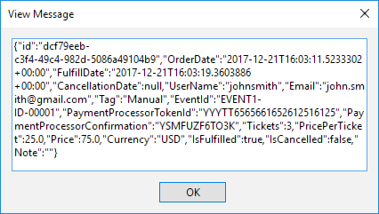

### Task 5: Set up the functions

In this task, you will create a function that will be triggered by the externalization queue we created for the app. Each order that is deposited to the queue by the TicketOrderActor type will trigger the ProcessOrderExternalizations function. The function then persists the order to the Orders collection of the Cosmos DB instance.

You will also create a second function that will be used to generate load against the system at runtime. Overall, the ContosoEvents app has the following queue and function architecture. This should help you visualize how the queues and functions are related.

![The ContosoEvents app architecture has two columns - Cosmos DB (Data Store), and Contoso Events (Web API). It also has three rows - Azure Functions, Azure Storage Queues, and Queue Sources. For Cosmos DB, its order of flow begins with Ticket Order Actor, Queue Source. An arrow then points up from Ticket Order Actor to Order Externalization (Its Azure Storage Queue), which then points up to Process order externalization (its Azure Function), which points to its endpoint, Cosmos DB Data Store. For Contoso Events, its order of flow begins with Service Fabric App, its Queue Source. An arrow then points up from there to Order Simulation (Its Azure Storage Queue), which then points up to Process order simulation (its Azure Function), which points to its endpoint, Contoso Events (Web API). its Azure Function is to process order simulization, Its Azure Storage Queue is Order Simulation, and its Queue Source is Service Fabric App. ](images/Labs/image101.png "ContosoEvents app architecture")

1.  There appears to be an issue with Azure Functions detecting Storage accounts, so before creating your function, you will manually add your Storage account connection string to the Application Settings for your Function App.

2.  In the Azure portal, browse to the Storage Account you created in Exercise 1, Step 5, then select Access keys under Settings on the left-hand menu, and copy the key1 Connection String value, as you did previously.

    

3.  Now, browse to the Function App you created in Exercise 1, Step 4.

4.  Select your Function App in the left-hand menu, then select Application settings under Configured features.

    

5.  On the Application Settings tab, scroll down and select +Add new setting under Application Settings, then enter contosoeventsstore in the name textbox, and paste the key1 Connection String value you copied from your Storage account into the value textbox.

    

6.  Scroll back to the top of the Application Settings tab, and select Save to apply the change.

    

7.  From the left-hand menu, place your mouse cursor over Functions, then select the + to the right of Functions.

    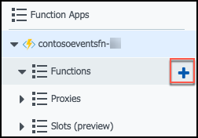

8.  Select Data processing under the Get started quickly... header, leave CSharp selected for the language, and select the Create this function button.

    

9.  First, let's rename the function, so it has a more meaningful name.

10. In the left-hand menu, select your Function app, then select the Platform features tab, and select Console under Development Tools.

    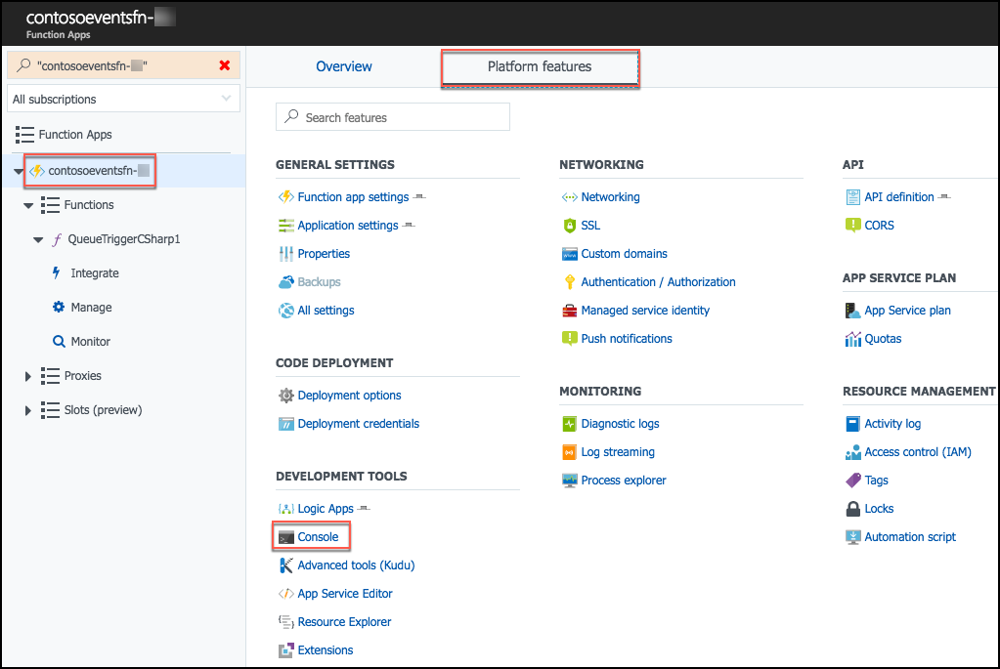

11. At the Console command prompt, type ls to view the list of functions and files in the wwwroot folder.

    

12. Next, paste the following command into the console to rename the QueueTriggerCSharp1 function to ProcessOrderExternalizations.

    ```
    rename QueueTriggerCSharp1 ProcessOrderExternalizations
    ```

13. Typing ls at the command prompt again will show the function has been renamed.

    

14. Exit the Console window by selecting the X in the top right corner, just below your account name.

    

15. Back on the Function app page, move your mouse cursor over your function app in the left-hand menu, and select the Refresh icon. Note the function name is still QueueTriggerCSharp1 before refreshing.

    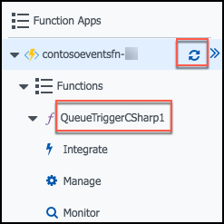

16. After the refresh, the function name will change in the display to ProcessOrderExternalizations.

    

17. Under the ProcessOrderExternalizations function, select Integrate.

    

18. On the Integrate screen, set the following:

    a.  Message parameter name: Enter orderItem

    b.  Storage account connection: Select the arrows in the box, then select the contosoevents-store connection from the list. This is the Application Setting you added above.

    

    c.  Queue name: Enter the name of your externalization queue (from Cloud explorer in Visual Studio). This should be contosoevents-externalization-requests.

    

    d.  Select Save.

19. While still on the Integrate screen, select +New Output.

    

20. In the outputs box, locate and select Azure Cosmos DB, then select Select.

    

21. On the Azure Cosmos DB output screen, enter the following:

    e.  Document parameter name: Enter orderDocument

    f.  Collection name: Enter Orders

    g.  Partition key: Leave empty

    h.  Database name: Enter TicketManager

    i.  Azure Cosmos DB account connection: Select new next to the text box, and select the Cosmos DB you created in Exercise 1, Task 6.

    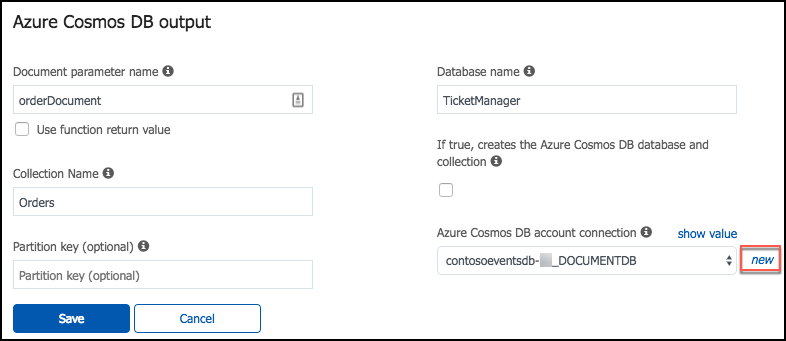

    j.  Select Save. You should now see an Azure Queue Storage trigger and an Azure Cosmos DB output on the Integrate screen.

    

22. Next, select your function from the left-hand menu.

    

23. Now, you will retrieve the code for the function from a file in Visual Studio.

24. In Visual Studio, go to Solution Explorer, and locate ProcessTicketOrderExternalizationEvent.cs in the Azure Functions folder.

    

25. Select all the code in that file (CTRL+A) and copy (CTRL+C) it.

26. Return to your function's page in the Azure portal, and replace the code in the run.csx block with the code you just copied from Visual Studio, and select Save. The run.csx code should now look like the following. Note: The ProcessOrdersExternalization function will enable you to process another order, and see that it is saved to the Orders collection of the Cosmos DB.

    

27. You will now create another function.

28. As before, select + next to Functions in the left-hand menu.

    

29. In the Choose a template... screen that appears, locate the Queue trigger box, and select PowerShell.

    

    > **Note**: If the PowerShell option does not show, ensure that the Experimental Language Support is set to Enabled.

30. In the Queue trigger dialog, enter the following:

    k.  Language: Leave PowerShell selected

    l.  Name: Enter ProcessSimulationRequests

    m.  Queue name: Enter your simulation queue name, from Cloud explorer in Visual Studio. The value should be contosoevents-simulation-requests.

    n.  Storage account connection: Select contosoeventsstore from the drop down

    o.  Select Create to create the new function

    

31. Select Integrate under the new ProcessSimulationRequests function in the left-hand menu.

    

32. Make sure Azure Queue Storage is selected under Triggers, then enter the following:

    p.  Message parameter name: Enter simulationRequest

    q.  Storage account connection: Leave set to contosoeventsstore

    r.  Queue name: Leave as contosoevents-simulation-requests

    s.  Select Save.

    

33. Select the ProcessSimulationRequests function in the left-hand menu.

    

34. Return to Visual Studio, and open the ProcessTicketOrderSimulationRequest.ps1 file in the Azure Functions folder.

    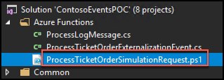

35. Copy all the contents of this file (CTRL+A, then CTRL+C), then return to your function page in the Azure portal, and paste the code into the run.ps1 code block.

36. Select Save.

37. The final setting to update is the API Management key. You will return to set this up when you set up the API Management service.

### Task 6: Test order data sync

In this task, you will test the ticket order processing back-end, to validate that orders are queued and processed by the ProcessOrderExternalizations function -- ultimately saving the order to the Orders collection of the Cosmos DB instance.

1.  In the Azure Portal, navigate to the Function App.

2.  Select the ProcessOrderExternalizations function (may be listed as the default QueueTriggerCSharp1 name if you did not rename it), and select Logs at the bottom of the screen. Leave the window open with the Logs visible.

    

3.  Repeat the steps to post an order via Swagger to the /api/orders endpoint (Task 4, Test configurations, Steps 2 -- 5).

4.  As orders are processed, you will see activity in the function logs in the Azure portal.

    

5.  Copy the order id of the function just processed. You will use this information below to verify the order was persisted to the Orders collection in Cosmos DB.

6.  If logs are not appearing in this view, click the Monitor tab under the ProcessOrderExternalizations function, then select a log item that has an "id" parameter value passed to the function, as shown below:

    

7.  In the Azure portal, navigate to your Cosmos DB account, and from the top menu of the Overview blade, select Data Explorer.

    

8.  In Cosmos DB Data Explorer, select Orders under the TicketManager database, then select New SQL Query from the toolbar, and enter the following query into the Query 1 window, replacing the ID in red with the order id you copied above.

```
    SELECT * FROM c WHERE c.id = '56dab32a-4154-4ea5-befa-2eb324e142ee'
```

9.  Select Execute Query.

    

10. If the Cosmos DB query returns the order id specified, the order has been fully processed through to the Cosmos DB.

## Exercise 4: Publish the Service Fabric Application

Duration: 15 minutes

In this exercise, you will publish the Service Fabric Application to the Azure cluster you created previously. After it is deployed, you will validate it by sending orders through the Web API endpoints exposed from the cluster.

### Task 1: Publish the application

In this task, you will deploy the application to a hosted Service Fabric Cluster.

1.  In Visual Studio on your Lab VM, within Solution Explorer, open Cloud.xml from the ApplicationParameters folder of the ContosoEventsApp project, under the Service Fabric folder. This file contains parameters we can use for publishing to the hosted cluster, as opposed to the local cluster.

    

2.  Open Local.1Node.XML from the same folder.

3.  To make sure you are using the same parameters you setup earlier for the Local cluster, copy just the following parameters from Local.1Node.xml to Cloud.xml, overwriting the existing parameters in Cloud.xml, then save Cloud.xml.

```
    <Parameter Name="DataStorageEndpointUri" Value="" />
    <Parameter Name="DataStoragePrimaryKey" Value="" />
    <Parameter Name="DataStorageDatabaseName" Value="TicketManager" />
    <Parameter Name="DataStorageEventsCollectionName" Value="Events" />
    <Parameter Name="DataStorageOrdersCollectionName" Value="Orders" />
    <Parameter Name="DataStorageLogMessagesCollectionName" Value="LogMessages" />
    <Parameter Name="StorageConnectionString" Value="" />
    <Parameter Name="LogsStorageTableName" Value="prodlogs" />
    <Parameter Name="ExternalizationQueueName" Value="contosoevents-externalization-requests"/>
    <Parameter Name="SimulationQueueName" Value="contosoevents-simulation-requests" />
```

4.  Review the settings related specifically to cloud publishing.

5.  In Cloud.xml, verify the WebAPi\_InstanceCount parameter is set to -1. This instructs the cluster to create as many instances of the Web API as there are nodes in the cluster.

6.  In Cloud.xml, verify the TicketOrderService\_PartitionCount parameter is set to 5.

```
    <Parameter Name="TicketOrderService_PartitionCount" Value="5" />
    <Parameter Name="TicketOrderService_MinReplicaSetSize" Value="3" />
    <Parameter Name="TicketOrderService_TargetReplicaSetSize" Value="3" />
    <Parameter Name="WebApi_InstanceCount" Value="-1" />
    <Parameter Name="TicketOrderActorService_PartitionCount" Value="5" />
    <Parameter Name="EventActorService_PartitionCount" Value="1" />
```

7.  From Solution Explorer, right-click the ContosoEventsApp project and select Publish.

8.  In the Publish Service Fabric Application dialog, set the Target profile to Cloud.xml, and select your Service Fabric Cluster endpoint from the Connection Endpoint drop down, then select Publish.

    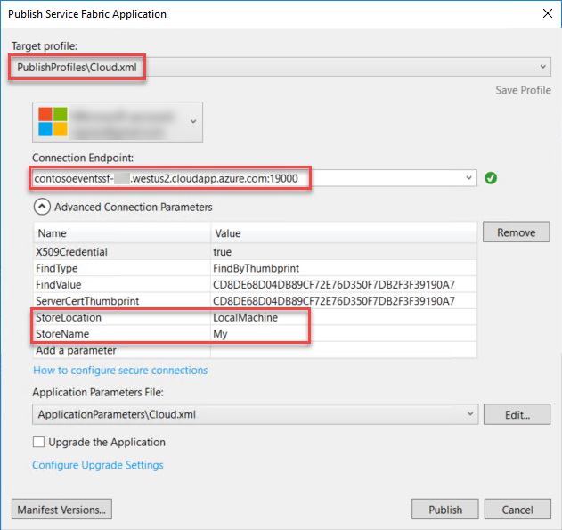

9.  Publishing to the hosted Service Fabric Cluster takes about 5 minutes. It follows the same steps as a local publish step with an alternate configuration. The Visual Studio output window keeps you updated of progress.

10. From the Visual Studio output window, validate that the deployment has completed successfully before moving on to the next task.

### Task 2: Test an order from the cluster

In this task, you will test an order against your application deployed to the hosted Service Fabric Cluster.

1.  In a Chrome browser on your Lab VM, navigate to the Swagger endpoint for the Web API exposed by the hosted Service Fabric cluster. The URL is made of:

    > For example:
    >
    > <http://contosoeventssf-SUFFIX.eastus.cloudapp.azure.com:8082/swagger/ui/index>

2.  Expand the Orders API and expand the POST method of the /api/orders endpoint.

    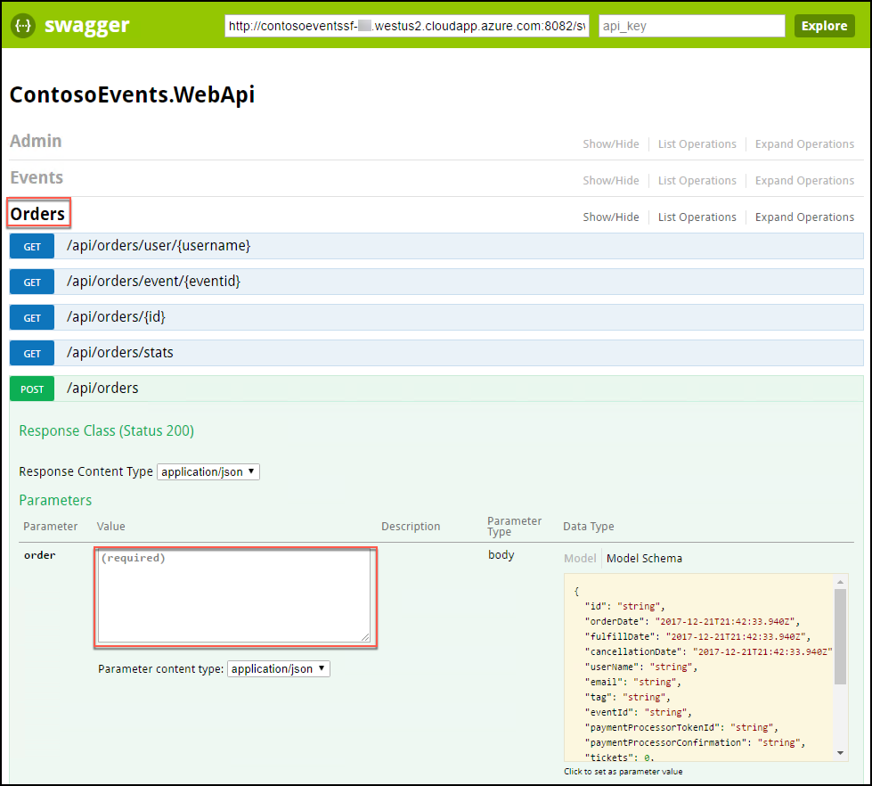

3.  Copy the JSON below, and paste it into the order field, highlighted in the screen shot above, then select Try it out.

    ```
        {
        "UserName": "johnsmith",
        "Email": "john.smith@gmail.com",
        "Tag": "Manual",
        "EventId": "EVENT1-ID-00001",
        "PaymentProcessorTokenId": "YYYTT6565661652612516125",
        "Tickets": 3
        }
    ```

    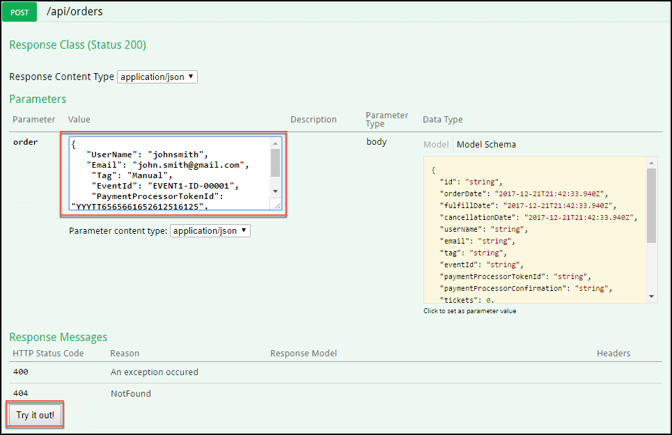

4.  This should return with HTTP 200 response code. The Response Body includes a unique order id that can be used to track the order. Copy the Response Body value. It will be used to verify the order was persisted in Cosmos DB.

    

5.  Verify that the order was persisted to the Orders collection.

6.  In the Azure portal, navigate to your Cosmos DB account.

7.  Perform a query against the Orders collection, as you did previously, to verify the order exists in the collection. Replace the id in the query with the order id you copied from the Response Body above.

    

## Exercise 5: API Management

Duration: 15 minutes

In this exercise, you will configure the API Management service in the Azure portal.

### Task 1: Import API

In this task, you will import the Web API description to your API Management service to create an endpoint.

1.  In the Azure portal, navigate to the hands-on-labs resource group, and select your API Management Service from the list of resources.

    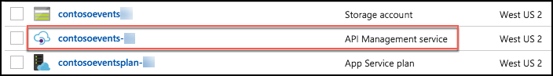

2.  In the API Management blade, select APIs under Api Management.

    

3.  In the APIs blade, select OpenAPI specification.

    

4.  Return to your Swagger browser window, and copy the URL from the textbox at the top of the screen, next to the Swagger logo, as shown in the screen shot below.

    

5.  Return to the Create from OpenAPI specification window, and do the following:

    a. Paste the URL copied from Swagger into the OpenAPI specification textbox.

    b. Select HTTPs as the URL scheme.

    c. Enter events in the API URL suffix textbox.

    d. Note the URL under "Base URL". You will use this URL in your website configuration in the next exercise.

    e. Select Unlimited in the Products.

    f. Select Create.

    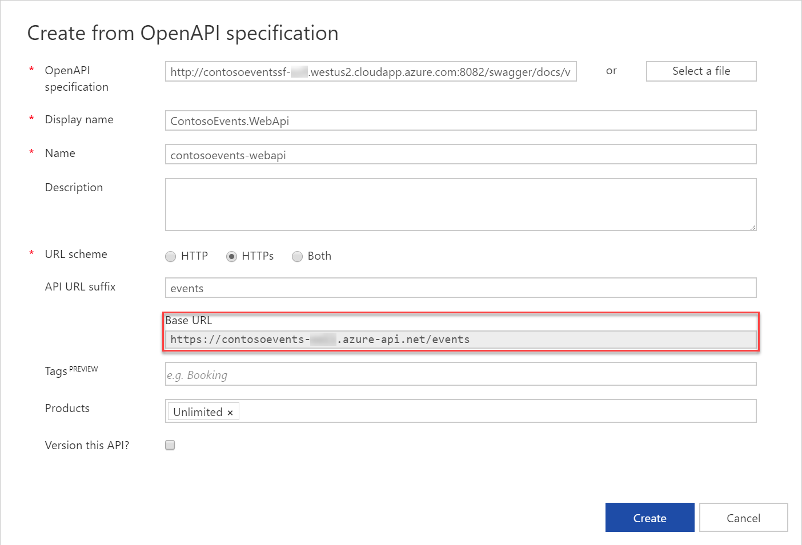

    > **Note**: You would typically create a new product for each environment in a scenario like this one. For example, Development, Testing, Acceptance and Production (DTAP) and issue a key for your internal application usage for each environment, managed accordingly.

6.  Select Settings in the ContosoEvents.WebApi toolbar, update Web Service URL so that it uses HTTP instead of HTTPS, and select Save

    

7.  Select ContosoEvents.WebApi from the All APIs list, and then select Design. You will see your API backend endpoint.

    

### Task 2: Retrieve the user subscription key

In this task, you will retrieve the subscription key for the client applications to call the new API Management endpoint.

1.  In the Azure portal, navigate to your API Management service, and from the Overview blade, select Developer portal from the toolbar. This will open a new browser tab, and log you into the Developer portal as an administrator, giving you the rights you need to complete the following steps.

    

2.  In the Developer portal, expand the Administrator menu, and then select Profile.

    

3.  Select Show for the Primary Key of the Unlimited subscription to reveal it.

    

4.  Save this key for next steps.

    

5.  You now have the API Management application key you will need to configure the Function App settings.

### Task 3: Configure the Function App with the API Management key

In this task, you will provide the API Management key in a setting for the Function App, so it can reach the Web API through the API Management service.

1.  From the Azure Portal, browse to the Function App.

2.  You will create an Application setting for the function to provide it with the API Management consumer key.

3.  Select your Function App in the left-hand menu, then select Application settings under Configured features.

    

4.  Scroll down to the Application settings section, select +Add new setting, and enter contosoeventsapimgrkey into the name field, and paste the API key you copied from the Developer portal above into the value field.

    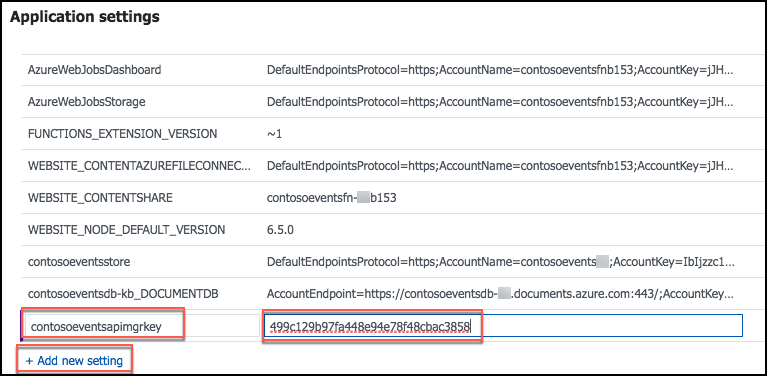

5.  Scroll back to the top of the Application Settings tab, and select Save to apply the change.

    

## Exercise 6: Configure and publish the web application

Duration: 15 minutes

In this exercise, you will configure the website to communicate with the API Management service, deploy the application, and create an order.

### Task 1: Configure the web app settings

In this task, you will update configuration settings to communicate with the API Management service. You will be guided through the instructions to find the information necessary to populate the configuration settings.

1.  Within Visual Studio Solution Explorer on your Lab VM, expand the Web folder, then expand the ContosoEvents.Web project, and open Web.config. You will update these appSettings in this file:

    ```
    <add key="apimng:BaseUrl" value="" \>
    <add key="apimng:SubscriptionKey" value="" \>
    ```

    

2.  For the apimng:BaseUrl key, enter the base URL of the API you created in the API Management Publisher Portal (Exercise 5, Task 1, Step 5), such as <http://contosoeventsSUFFIX.azure-api.net/events/>.

    > **Note**: Make sure to include a trailing "/" or the exercise will not work.

3.  For the apimng:SubscriptionKey key, enter the subscription key you revealed in API Management developer portal (Exercise 5, Task 2, Step 4).

4.  Save Web.config. You should have values for two of the API Management app settings.

    

### Task 2: Running the web app and creating an order

In this task, you will test the web application calls to API Management by creating an order through the UI.

1.  Using Solution Explorer in Visual Studio, expand the Web folder, then right-click the ContosoEvents.Web project, select Debug, and then Start new instance.

    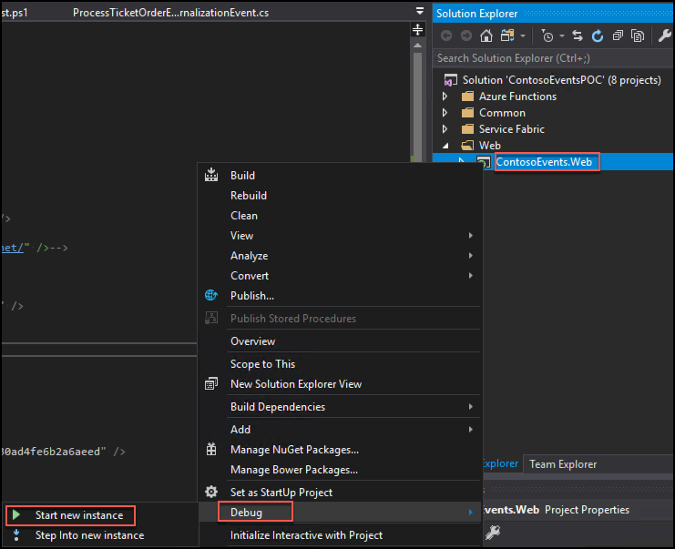

2.  If prompted about whether you would like to trust the IIS Express SSL certificate, select Yes, then select Yes again at the Security Warning prompt.

    

3.  If you receive a warning in the browser that "Your connection is not private," select Advanced.

    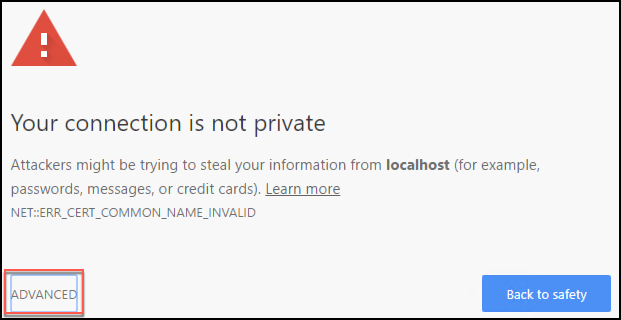

4.  Under Advanced, select Proceed to localhost (unsafe).

    

5.  When the application launches you will see the website home page as shown in the following screen shot.

    

6.  Note the event presented on the home page has an Order Tickets Now button. Click that to place an order.

7.  Choose the number of tickets for the order, and then scroll down to see the billing fields.

    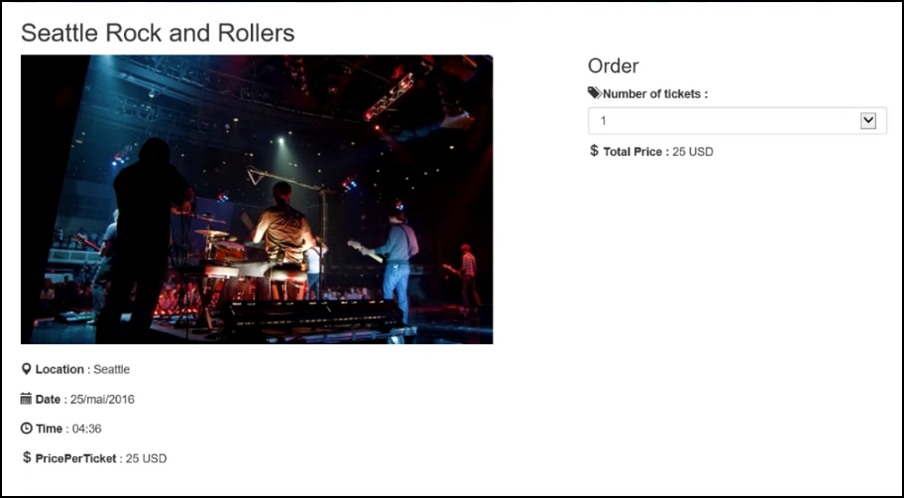

8.  Enter values into the empty fields for your email, first name, last name, and Cardholder name.

    

9.  Select Place Order.

10. Once the order is queued for processing, you will be redirected to a results page as shown in the following screen shot. It should indicate Success and show you the order id that was queued as confirmation.

    

11. Close the web browser to stop debugging the application.

### Task 3: Publish the web app

In this task, you will publish the web application to Azure.

1.  From the Visual Studio Solution Explorer, right-click ContosoEvents.Web, and select Publish.

    

2.  Select the App Service option, choose Select Existing, then select Publish.

    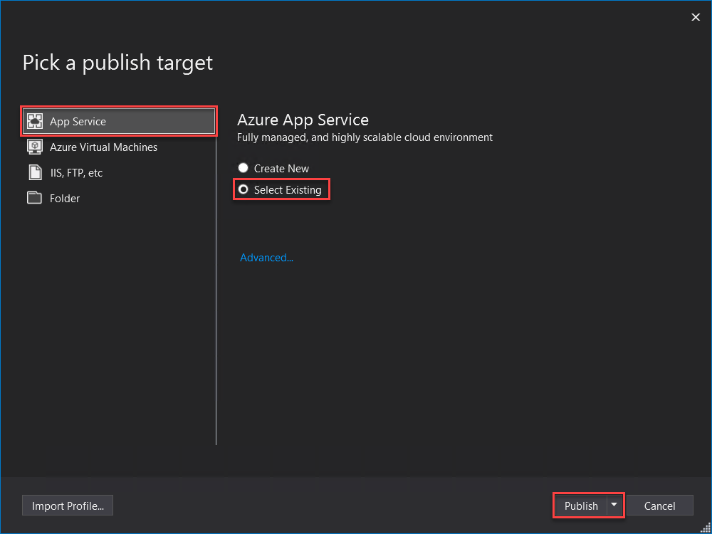

3.  You may be prompted to log in to your Microsoft Account with access to the subscription where you created the resources for this hands-on lab. After logging in, you can select the subscription in the App Service screen.

4.  From the list below, expand the Resource Group you created previously (hands-on-labs), and select the web app contosoeventsweb-SUFFIX. Select OK.

    

5.  If the Publish does not start automatically, select Publish next to the Web Deploy publishing profile.

    

6.  When publishing is complete, your browser will launch, and navigate to the deployed web app home page. You can optionally submit another order to validate functionality works as in Task 2.

## Exercise 7: Upgrading

Duration: 30 minutes

In this task, you will make changes to the code, and deploy an update to the application to enhance functionality. Specifically, the update addresses the area of concern related to changes in the ticket order model, and the impact on the system.

This task will illustrate the mechanism that Service Fabric provides for upgrading an application in production.

### Task 1: How upgrade works

In Service Fabric, deployments can be either regular or upgrade. A regular deployment erases any previous deployment data while the upgrade deployment preserves it. There are advantages to upgrades:

-   Stateful service data will not be lost during upgrade

-   Availability remains during the upgrade

The following figure illustrates the deployment hierarchy:

![The Deployment hierarchy diagram starts on the left with Deployment, which has two lines leading to Regular (Replaces,) and Upgrade (Preserves). Upgrade has two lines leading to Control, and Modes. Control has two lines to Health Check Policies, and Upgrade Parameters. Upgrade Parameters has two two lines to Healthy Check Retry Timeout, and Others. From Upgrade, as previously stated, the second line leads to Modes. Modes then has three lines to Monitored, which automates the upgrade and health check; Unmonitored Auto, which Automates the upgrade but skips the health check; and Unmonitored Manual, which manually upgrades each upgrade domain.](images/Labs/image166.png "Deployment hierarchy diagram")

If you set the upgrade mode to Monitored, Service Fabric will be in full control of the upgrade process. There is a configurable time to wait after the upgrade has finished before Service Fabric evaluates the health of the application. This value defaults to 600 seconds.

### Task 2: Update an actor state

Currently, the TicketOrderActor does not have a status property to make it easier to check on the actor order status quickly. In this task, you will modify the Ticket Order State model to add a new status property.

1.  In Visual Studio on the Lab VM, open TicketOrder.cs in the ContosoEvents.Models project, under the Common folder.

    

2.  Edit the TicketOrder type to include a status field based on an Enum. Uncomment all TODO: Exercise 6 -- Task 1 -- there are two places as shown below:

```
    //TODO: Exercise 6 - Task 1
    [DataMember]
    public OrderStatuses Status { get; set; }
```

3.  and

```
    //TODO: Exercise 6 - Task 1
    public enum OrderStatuses
    {
    Fufilled,
    TicketsExhausted,
    CreditCardDenied,
    Cancelled,
    Invalid
    }
```

4.  Save TicketOrder.cs.

5.  From Solution Explorer, open TicketOrderActor.cs in the ContosoEvents.TicketOrderActor project, under the Service Fabric folder.

6.  Edit the TicketOrderActor to add the new order status. Uncomment all TODO: Exercise 6 -- Task 1. The change will uncomment several lines that set the new Status field to one of the OrderStatuses enumeration values. Be sure to find all of the following comments (there are 6 total):

```
    //TODO: Exercise 6 - Task 1
    state.Status = OrderStatuses.Invalid;
    //TODO: Exercise 6 - Task 1
    state.Status = OrderStatuses.Fufilled;
    //TODO: Exercise 6 - Task 1
    state.Status = OrderStatuses.CreditCardDenied;
    //TODO: Exercise 6 - Task 1
    state.Status = OrderStatuses.TicketsExhausted;
    //TODO: Exercise 6 - Task 1
    state.Status = OrderStatuses.Invalid;
    //TODO: Exercise 6 - Task 1
    state.Status = OrderStatuses.Cancelled;
```

7.  Save TicketOrderActor.cs.

8.  After adding this field, the actor will now save it with each ticket order.

9.  After making this change, rebuild the solution (Build menu, Rebuild solution), and verify that there are no errors.

### Task 3: Perform a smooth upgrade

In this task, you will configure settings for the Service Fabric application to perform an upgrade.

1.  From the Visual Studio Solution Explorer, expand the Service Fabric folder, then right-click ContosoEventsApp, and select Publish.

2.  In the Public Service Fabric Application dialog, select PublishProfiles\\Cloud.xml for the target profile, and check Upgrade the Application.

    

3.  Select Configure Upgrade Settings, under Upgrade the Application. Select Monitored for the upgrade mode, then select OK.

    

4.  From the Publish Service Fabric Application dialog, select Manifest Versions.

5.  Change the TicketOrderActorPkg\\Code New Version to 1.1.0. This change will force the actor package and the app to change to 1.1.0 as well.

    

6.  Select Save.

7.  Now that the upgrade configuration is set, select Publish.

8.  Observe the Visual Studio Output window going through the upgrade process, which can take 5 minutes or more.

    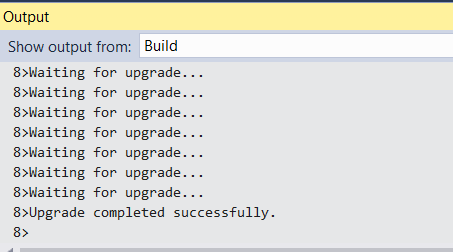

9.  Navigate to the Service Fabric Explorer for the deployment using your URL, something like: <http://contosoeventssf-SUFFIX.eastus.cloudapp.azure.com:19080/Explorer/index.html>. You can retrieve this from the Azure portal, by navigating to your Service Fabric cluster's blade by selecting the Explorer button on the toolbar, or selecting the Service Fabric Explorer link in the Essentials area.

    

10. It will show the app being upgraded one upgrade domain at a time.

    

11. When the upgrade is complete, from Service Fabric Explorer observe the new application version number.

    

### Task 4: Submit a new order

Now that the upgrade is completed successfully, you will submit a new order, and make sure that the newly submitted order has the extended state.

1.  This time, you will post an order using the Web API for the deployed service. The order can be something like this:

```
    {
    "userName": "testupgrade",
    "email": "test.upgrade@gmail.com",
    "eventId": "EVENT1-ID-00001",
    "paymentProcessorTokenId": "ggashwh565-uiewuu87-ujdsk",
    "tickets": 3
    }
```

2.  Access the Swagger UI for your published Service Fabric Web API at a URL that looks like this: <http://contosoeventssf-SUFFIX.eastus.cloudapp.azure.com:8082/swagger/ui/index>

3.  Access the Orders API and select the POST method for the /api/orders endpoint. From there you can submit a new order using the JSON above.

    

4.  Once you get back a 200 response code, the order id will be returned in the Response Body.

    

5.  In the Azure portal, navigate to your Cosmos DB account.

6.  Go to Cosmos DB Data Explorer, and query for the order id to see the new extended state actually persisted to the database, as you did in Exercise 3, Task 6, Steps 7-9.

    

## After the hands-on lab

Duration: 10 minutes

In this exercise, attendees will deprovision any Azure resources that were created in support of the lab. You should follow all steps provided after attending the Hands-on lab.

### Task 1: Delete the resource group

1.  Using the Azure portal, navigate to the Resource group you used throughout this hands-on lab by selecting Resource groups in the left menu.

2.  Search for the name of your research group, and select it from the list.

3.  Select Delete in the command bar, and confirm the deletion by re-typing the Resource group name, and selecting Delete.
