# Microservices Architecture setup

## Requirements

1.  Microsoft Azure subscription must be pay-as-you-go or MSDN.

    -   Trial subscriptions will not work.

2.  A virtual machine configured with (see Before the hands-on lab):

    -   Visual Studio 2017 Community edition, or later

    -   Azure Development workload enabled in Visual Studio 2017 (enabled by default on the VM)

    -   Service Fabric SDK 3.1 or later for Visual Studio 2017

    -   Google Chrome browser (Swagger commands do not work in IE)

    -   PowerShell 3.0 or higher (v5.1 already installed on VM)

## Before the hands-on lab

Duration: 45 minutes

Synopsis: In this exercise, you will set up your environment for use in the rest of the hands-on lab. You should follow all the steps provided in the Before the hands-on lab section to prepare your environment before attending the hands-on lab.

IMPORTANT: Most Azure resources require unique names. Throughout these steps, you will see the word "SUFFIX" as part of resource names. You should replace this with your Microsoft alias, initials, or other value to ensure the resource is uniquely named.

### Task 1: Provision Service Fabric Cluster

In this task, you will provision the Service Fabric Cluster in Azure.

1.  In the Azure portal, select +New, then type "Service Fabric" into the Search the Marketplace box. Select Service Fabric Cluster from the results.

    

2.  On the Service Fabric Cluster blade, select Create.

3.  On the Basics blade of the Create Service Fabric cluster screen, enter the following:

-   Cluster name: Enter contosoeventssf-SUFFIX, replacing SUFFIX with your alias, initials, or another value to make the name unique (indicated by a green check in the text box).

-   Operating system: Set to WindowsServer 2016-Datacenter

-   User name: Enter holuser

-   Password: Enter Password.1!!

-   Subscription: Select the subscription you are using for this lab

-   Resource Group: Select Create new, and enter hands-on-labs for the resource group name. You can add -SUFFIX, if needed to make resource group name unique. This is the resource group you will use for all resources you create for this hands-on lab.

-   Location: Select the region to use.

-   Select OK.

    

4.  On the Cluster configuration blade, set the following:

-   Node type count: Select 1

-   Node type 1 (Primary): Select to configure required settings. On the Node type configuration blade enter:

    -   Node type name: Enter Web

    -   Durability tier: Leave Bronze selected

    -   Virtual machine size: Select a VM size of D1\_V2 Standard and select Select on the Choose a size blade.

        

    -   Single node cluster: Leave unchecked

    -   Initial VM scale set capacity: Leave set to 5

    -   Custom endpoints: Enter 8082. This will allow the Web API to be accessible through the cluster.

    -   Enable reverse proxy: Leave unchecked

    -   Configure advanced settings: Leave unchecked

    -   Select OK on the Node type configuration blade.

    -   Select OK on the Cluster configuration blade.

    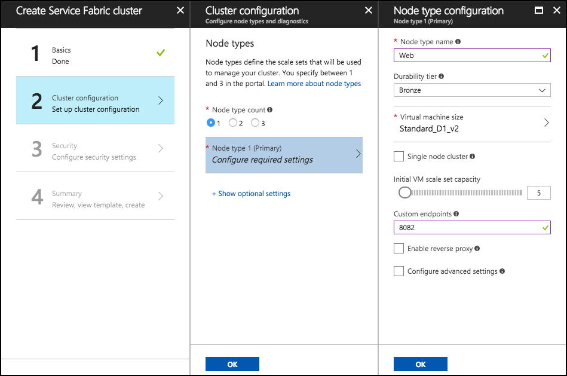

5.  On the Security blade, you can provide security settings for your cluster. This configuration is completed up front, cannot be changed later. Set the following:

-   Configuration Type: Leave "Basic" selected

-   Key vault: Select to configure required settings. On the Key vault configuration blade click "Create a new vault".

-   On the "Create key vault" configuration blade enter:

    -   Name: hands-on-lab-SUFFIX

    -   Resource Group: hands-on-lab2-SUFFIX

    -   Location: Use the same location as the first resource group you created.

        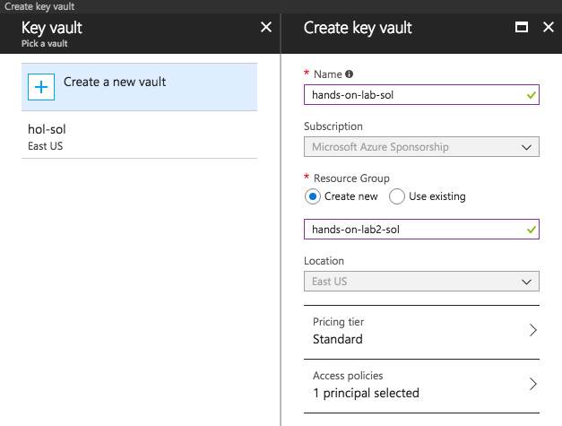

-   Click "Create" on the Create key vault configuration blade. Wait for the key vault deployment to complete.

-   When the key vault deployment completes you will return to the Security configuration blade. You will see a warning that the key vault is not enabled for deployment. Follow these steps to resolve the warning:

    -   Click "Edit access policies for hands-on-lab-SUFFIX"

    -   In the Access policies configuration blade, click the link "Click to show advanced access policies"

    -   Check the "Enable access to Azure Virtual Machines for deployment" checkbox.

    -   Click "Save". When the key vault update completes, close the Access policies blade.

        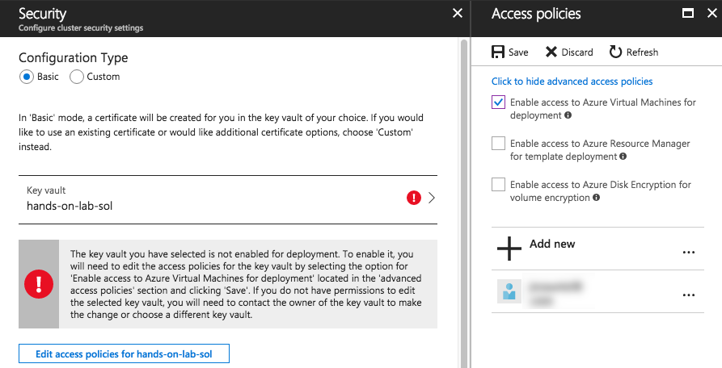

    -   Enter "hands-on-lab-SUFFIX" as the certificate name. Then click OK on the Security configuration blade.

6.  On the Summary blade, review the summary, and select Create to begin provisioning the new cluster.

    

7.  It can take up to 30 minutes or more to provision your Service Fabric Cluster. You can move on to the next task while you wait.

**Note**: If you experience errors related to lack of available cores, you may have to delete some other compute resources, or request additional cores to be added to your subscription, and then try this again.

### Task 2: Provision a lab virtual machine (VM)

In this task, you will provision a virtual machine (VM) in Azure. The VM image used will have Visual Studio Community 2017 installed.

1.  Launch a web browser and navigate to the [Azure portal](https://portal.azure.com/).

2.  Select +New, then type "Visual Studio" into the search bar. Select Visual Studio Community 2017 (latest release) on Windows Server 2016 (x64) from the results.

    

3.  On the blade that comes up, ensure the deployment model is set to Resource Manager and select Create.

    

4.  Set the following configuration on the Basics tab.

    -   Name: Enter LabVM

    -   VM disk type: Leave SSD selected

    -   User name: Enter holuser

    -   Password: Enter Password.1!!

    -   Subscription: Select the subscription you are using for this lab

    -   Resource group: Select Use existing, and select the hands-on-labs resource group created previously.

    -   Location: Select the region you are using for resources in this lab.

    -   Select OK to move to the next step.

        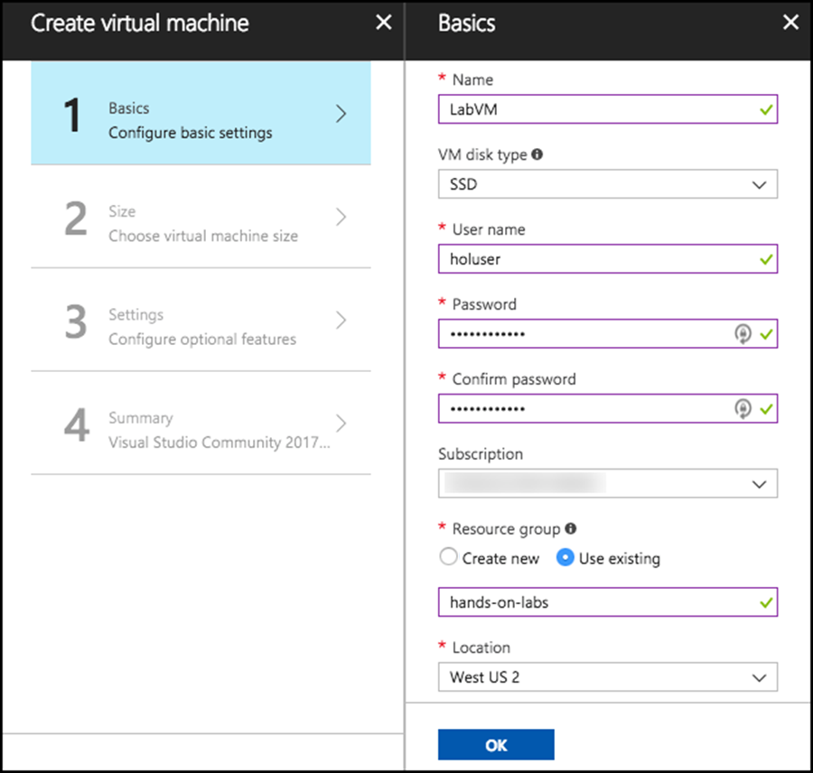

5.  On the Choose a size blade, ensure the Disk type is set to SSD. This machine won't be doing much heavy lifting, so selecting D2S\_V3 Standard is a good baseline option.

    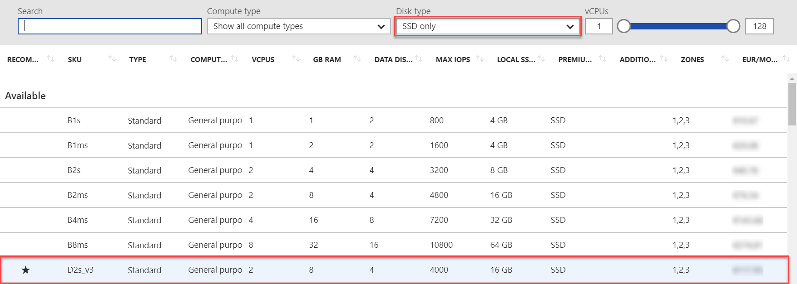

6.  Select Select to move on to the Settings blade.

7.  Accept all the default values on the Settings blade and select OK.

8.  Select Create on the Create blade to provision the virtual machine.

    

9.  It may take 10+ minutes for the virtual machine to complete provisioning.

### Task 3: Connect to your lab VM

In this step, you will open an RDP connection to your Lab VM and disable Internet Explorer Enhanced Security Configuration.

1.  Connect to the Lab VM. (If you are already connected to your Lab VM, skip to Step 9)

2.  From the left side menu in the Azure portal, select Resource groups, then enter your resource group name into the filter box, and select it from the list.

    

3.  Next, select your lab virtual machine, LabVM, from the list.

    

4.  On your Lab VM blade, select Connect from the top menu.

    

5.  Download and open the RDP file.

6.  Select Connect on the Remote Desktop Connection dialog.

    

7.  Enter the following credentials (or the non-default credentials if you changed them):

    a.  User name: holuser

    b.  Password: Password.1!!

    

8.  Select Yes to connect, if prompted that the identity of the remote computer cannot be verified.

    

9.  Once logged in, launch the Server Manager. This should start automatically, but you can access it via the Start menu if it does not start.

    

10. Select Local Server, then select On (might also display Off) next to IE Enhanced Security Configuration.

    

11. In the Internet Explorer Enhanced Security Configuration dialog, select Off under Administrators and under Users, then select OK.

    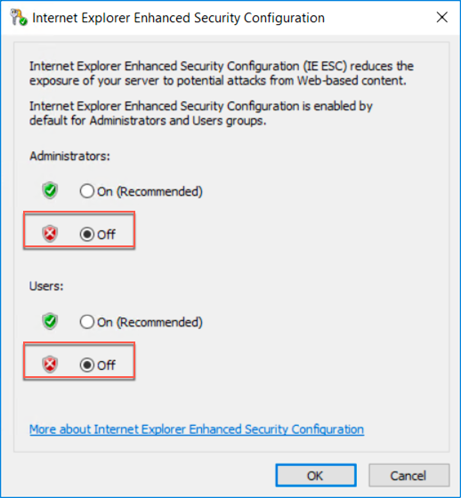

12. Close the Server Manager.

### Task 4: Install Chrome on LabVM

In this task, you will install the Google Chrome browser on your Lab VM.

1.  On your Lab VM, open a web browser, and navigate to <https://www.google.com/chrome/browser/desktop/index.html>, and select Download Chrome.

    

2.  Select Accept and Install on the terms of service screen.

    

3.  Select Run on the Application Run -- Security Warning dialog.

    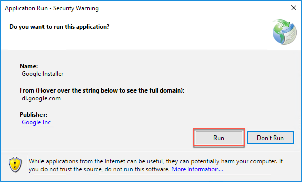

4.  Select Run again, on the Open File -- Security Warning dialog.

    

5.  Once the Chrome installation completes, a Chrome browser window should open. For ease, you can use the instructions in that window to make Chrome your default browser.

### Task 5: Install Service Fabric SDK for Visual Studio

In this task, you will install the latest Service Fabric SDK for Visual Studio 2017 on your Lab VM.

1.  On your Lab VM, open a browser, and navigate to <https://docs.microsoft.com/azure/service-fabric/service-fabric-get-started>.

2.  Scroll down on the page to the Install the SDK and tools section and select Install the Microsoft Azure Service Fabric SDK under the To use Visual Studio 2017 heading.

    

3.  Run the downloaded executable and select Install in the Web Platform Installer screen.

    

4.  On the Prerequisites screen, select I Accept.

    

5.  Select Finish when the install completes.

    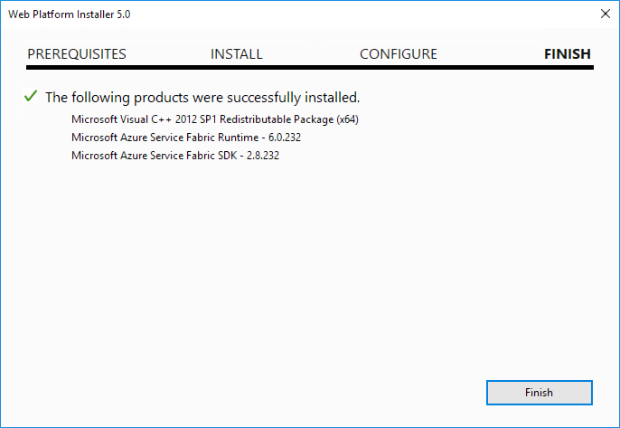

6.  Select Exit on the Web Platform installer to close it.

7.  Restart the VM to complete the installation and start the local Service Fabric cluster service.

### Task 6: Setup Service Fabric certificate

When you create a new Service Fabric Cluster using the portal, a secure cluster is deployed. In order to later on be able to make use of it, a certificate setup is required.

In this task, you will download the required certificate and install it on your Lab VM.

1.  In the Azure portal, navigate to the Resource Group you created previously and where you created the Key vault that supports the cluster.

2.  Select the key vault from the list of resources in the resource group.

    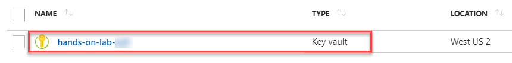

3.  Under the Settings category in the left-hand menu, select Certificates and then select the existing certificate.

    

4.  Select the Current Version of the existing certificate.

    

5.  In the certificate information blade, select Download in PFX/PEM format and save the certificate.

    

6.  Copy the downloaded certificate into the Lab VM.

7.  On the Lab VM, double-click the copied certificate to initiate it's installation. Select Local Machine as the Store Location and select Next.

    

8.  Select Next.

    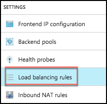

9.  Select Next.

    

10. Select Next.

    

11. Select Finish.

    

12. When the import finishes successfully, select OK.

    

13. On the Lab VM, double-click the copied certificate once again to initiate it's installation. Select Current User as the Store Location and select Next.

    

14. Select Next.

    

15. Select Next.

    

16. Select Next.

    

17. Select Finish.

    

18. When the import finishes successfully, select OK.

    

### Task 7: Validate Service Fabric ports

Occasionally, when you create a new Service Fabric Cluster using the portal, the ports that you requested are not created. This will become evident when you try to deploy and run the Web App, because the required ports will not be accessible through the cluster.

In this task, you will validate that the ports are open and if not, fix the issue.

1.  In the Azure portal, navigate to the Resource Group you created previously, and where you created the cluster. If your Service Fabric cluster is still deploying, do not proceed to the next step until the deployment is completed.

2.  Select the load balancer from the list of resources in the resource group.

    

3.  Under the Settings category in the left-hand menu, select Health probes.

    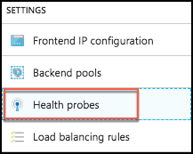

4.  Verify if a probe exists for port 8082, and that it is "Used By" a load balancing rule. If both of these are true, you can skip the remainder of this task. Otherwise, proceed to the next step to create the probe and load-balancing rule.

    

5.  Select +Add on the Health probes blade.

    

6.  On the Add health probe blade, enter the following:

    -   Name: Enter WebApiPortProbe

    -   Protocol: Select TCP

    -   Port: Enter 8082

    -   Interval: Leave the default value

    -   Unhealthy threshold: Leave the default value

    -   Select OK to create the probe.

        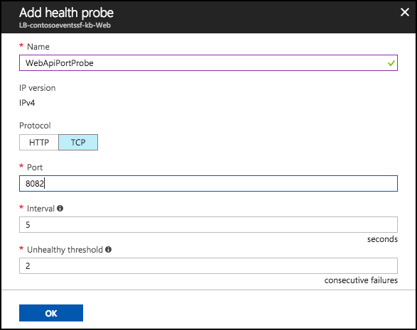

7.  Once the Health probe is added (this can take a few minutes to update), you will create a rule associated with this probe. Under the Settings block in the left-hand menu, select Load balancing rules.

    

8.  Select +Add on the Load balancing rules blade.

    

9.  On the Add Load balancing rules blade, enter the following:

    -   Name: Enter LBWebApiPortRule

    -   IP Version: Leave IPv4 selected

    -   Frontend IP address: Leave the default value selected

    -   Protocol: Leave as TCP

    -   Port: Set to 8082

    -   Backend port: Set to 8082

    -   Backend pool: Leave the default value selected

    -   Health probe: Select the WebApiPortProbe you created previously

    -   Leave the default values for the remaining fields, and Select OK.

    

10. If you get an error notification such as "Failure to create probe", ignore this, but just go check that the probe indeed exists. It should. You now have a cluster ready to deploy to and expose 8082 as the Web API endpoint / port.
